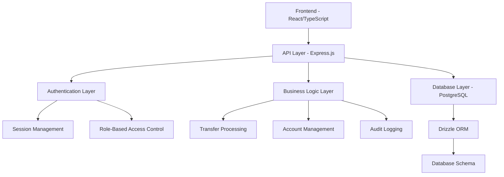

# Finora Banking Application - Developer Documentation

## 📚 Technical Documentation

This document provides detailed technical information for developers working on the Finora banking application.

## 🏗️ Architecture Deep Dive

### Application Architecture



### Request Flow

1. **Client Request** → Vite Dev Server/Express Static
2. **API Request** → Express.js Router
3. **Authentication** → Session Validation
4. **Authorization** → Role Permission Check
5. **Business Logic** → Service Layer Processing
6. **Data Access** → Drizzle ORM Operations
7. **Database** → PostgreSQL Queries
8. **Response** → JSON API Response
9. **Client Update** → React State Update

## 🔧 Technical Stack Details

### Frontend Technologies

| Technology | Version | Purpose |
|------------|---------|---------|
| React | 18.x | UI Component Library |
| TypeScript | 5.x | Type Safety |
| Vite | 5.x | Build Tool & Dev Server |
| Tailwind CSS | 3.x | Styling Framework |
| shadcn/ui | Latest | Component Library |
| Radix UI | Latest | Headless UI Primitives |
| TanStack Query | 5.x | Server State Management |
| React Hook Form | 7.x | Form Management |
| Wouter | 3.x | Client-Side Routing |
| Zod | 3.x | Schema Validation |

### Backend Technologies

| Technology | Version | Purpose |
|------------|---------|---------|
| Node.js | 18+ | Runtime Environment |
| Express.js | 4.x | Web Framework |
| TypeScript | 5.x | Type Safety |
| Drizzle ORM | Latest | Database ORM |
| PostgreSQL | 14+ | Primary Database |
| bcryptjs | 2.x | Password Hashing |
| express-session | 1.x | Session Management |
| connect-pg-simple | 9.x | PostgreSQL Session Store |

## 🗄️ Database Architecture

### Schema Design Principles

1. **Normalized Structure**: Proper foreign key relationships
2. **Type Safety**: Strong typing with Drizzle ORM
3. **Audit Trail**: Comprehensive logging for compliance
4. **Performance**: Indexed columns for fast queries
5. **Scalability**: UUID primary keys for distributed systems

### Table Relationships

```sql
-- Core Relationships
users (1) -----> (many) accounts
accounts (1) ---> (many) transactions
transfers (1) --> (many) transactions
users (1) -----> (many) audit_logs
users (1) -----> (many) email_notifications

-- Session Management
sessions (isolated table for auth)
```

### Database Schema Details

#### Users Table
```typescript
export const users = pgTable("users", {
  id: varchar("id").primaryKey().default(sql`gen_random_uuid()`),
  email: varchar("email").unique().notNull(),
  password: varchar("password"), // bcrypt hashed
  firstName: varchar("first_name"),
  lastName: varchar("last_name"),
  profileImageUrl: varchar("profile_image_url"),
  role: userRoleEnum("role").default('customer').notNull(),
  createdAt: timestamp("created_at").defaultNow(),
  updatedAt: timestamp("updated_at").defaultNow(),
});
```

#### Accounts Table
```typescript
export const accounts = pgTable("accounts", {
  id: uuid("id").primaryKey().default(sql`gen_random_uuid()`),
  userId: varchar("user_id").references(() => users.id).notNull(),
  accountNumber: varchar("account_number").unique().notNull(),
  routingNumber: varchar("routing_number").notNull().default('011075150'),
  accountType: varchar("account_type").notNull().default('checking'),
  balance: decimal("balance", { precision: 15, scale: 2 }).notNull().default('0.00'),
  status: accountStatusEnum("status").default('active').notNull(),
  createdAt: timestamp("created_at").defaultNow(),
  updatedAt: timestamp("updated_at").defaultNow(),
});
```

#### Transfers Table
```typescript
export const transfers = pgTable("transfers", {
  id: uuid("id").primaryKey().default(sql`gen_random_uuid()`),
  fromAccountId: uuid("from_account_id").references(() => accounts.id).notNull(),
  toAccountId: uuid("to_account_id").references(() => accounts.id),
  toAccountNumber: varchar("to_account_number"),
  toRoutingNumber: varchar("to_routing_number"),
  toBankName: varchar("to_bank_name"),
  toAccountHolderName: varchar("to_account_holder_name").notNull(),
  amount: decimal("amount", { precision: 15, scale: 2 }).notNull(),
  fee: decimal("fee", { precision: 15, scale: 2 }).notNull().default('0.00'),
  tax: decimal("tax", { precision: 15, scale: 2 }).notNull().default('0.00'),
  description: text("description"),
  status: transferStatusEnum("status").default('pending').notNull(),
  rejectionReason: text("rejection_reason"),
  approvedBy: varchar("approved_by").references(() => users.id),
  approvedAt: timestamp("approved_at"),
  completedAt: timestamp("completed_at"),
  createdAt: timestamp("created_at").defaultNow(),
  updatedAt: timestamp("updated_at").defaultNow(),
});
```

## 🔐 Authentication & Authorization

### Authentication Flow

```typescript
// 1. Password Verification
const isValidPassword = await verifyPassword(password, user.password);

// 2. Session Creation
passport.authenticate('local', (err, user, info) => {
  if (user) {
    req.logIn(user, (err) => {
      // Session established
    });
  }
});

// 3. Session Storage (PostgreSQL)
const sessionStore = new pgStore({
  conString: process.env.DATABASE_URL,
  createTableIfMissing: false,
  ttl: sessionTtl,
  tableName: "sessions",
});
```

### Role-Based Access Control

```typescript
// Middleware for protecting routes
export const isAuthenticated: RequestHandler = (req, res, next) => {
  if (req.isAuthenticated()) {
    return next();
  }
  return res.status(401).json({ message: "Unauthorized" });
};

// Role-specific middleware
export const requireAdmin: RequestHandler = (req, res, next) => {
  if (req.user?.role === 'admin') {
    return next();
  }
  return res.status(403).json({ message: "Admin access required" });
};
```

### Security Headers & Policies

```typescript
// Session Configuration
session({
  secret: process.env.SESSION_SECRET,
  resave: false,
  saveUninitialized: false,
  cookie: {
    httpOnly: true, // Prevent XSS
    secure: process.env.NODE_ENV === 'production', // HTTPS only in production
    maxAge: sessionTtl, // Session expiry
    sameSite: 'strict', // CSRF protection
  },
});
```

## 🔄 API Design Patterns

### RESTful Endpoint Structure

```
GET    /api/auth/user           # Get current user
POST   /api/login              # User login
POST   /api/logout             # User logout

GET    /api/accounts           # List user accounts
GET    /api/accounts/:id       # Get account details
POST   /api/accounts           # Create account

GET    /api/transfers          # List transfers
POST   /api/transfers          # Create transfer
PUT    /api/transfers/:id      # Update transfer status

GET    /api/admin/users        # List all users (admin)
PUT    /api/admin/users/:id    # Update user (admin)
GET    /api/admin/stats        # System statistics (admin)
```

### Request/Response Patterns

#### Standard Success Response
```typescript
{
  "success": true,
  "data": { /* response data */ },
  "message": "Operation completed successfully"
}
```

#### Standard Error Response
```typescript
{
  "success": false,
  "error": {
    "code": "VALIDATION_ERROR",
    "message": "Invalid input data",
    "details": [
      {
        "field": "email",
        "message": "Invalid email format"
      }
    ]
  }
}
```

### Input Validation

```typescript
// Zod Schema Example
const transferSchema = z.object({
  fromAccountId: z.string().uuid(),
  toAccountNumber: z.string().min(10).max(12),
  amount: z.string().regex(/^\d+\.\d{2}$/),
  description: z.string().optional(),
});

// Route Implementation
app.post('/api/transfers', validateRequest(transferSchema), async (req, res) => {
  try {
    const transfer = await storage.createTransfer(req.body);
    res.json({ success: true, data: transfer });
  } catch (error) {
    res.status(500).json({ 
      success: false, 
      error: { message: "Transfer creation failed" } 
    });
  }
});
```

## 📊 Data Access Layer

### Storage Interface Pattern

```typescript
// storage.ts - Abstract interface
interface IStorage {
  // User operations
  createUser(user: InsertUser): Promise<User>;
  getUser(id: string): Promise<User | null>;
  getUserByEmail(email: string): Promise<User | null>;
  updateUser(id: string, updates: Partial<User>): Promise<User>;
  
  // Account operations
  createAccount(account: InsertAccount): Promise<Account>;
  getAccountsByUser(userId: string): Promise<Account[]>;
  updateAccountBalance(id: string, balance: string): Promise<Account>;
  
  // Transfer operations
  createTransfer(transfer: InsertTransfer): Promise<Transfer>;
  getTransfersByAccount(accountId: string): Promise<Transfer[]>;
  updateTransferStatus(id: string, status: string): Promise<Transfer>;
}
```

### Database Queries with Drizzle

```typescript
// Complex join query example
const getUserWithAccounts = async (userId: string) => {
  return await db
    .select({
      user: users,
      accounts: sql`json_agg(${accounts})`.as('accounts'),
    })
    .from(users)
    .leftJoin(accounts, eq(accounts.userId, users.id))
    .where(eq(users.id, userId))
    .groupBy(users.id);
};

// Transaction example
const transferMoney = async (fromId: string, toId: string, amount: string) => {
  return await db.transaction(async (tx) => {
    // Debit from account
    await tx
      .update(accounts)
      .set({ balance: sql`${accounts.balance} - ${amount}` })
      .where(eq(accounts.id, fromId));
    
    // Credit to account
    await tx
      .update(accounts)
      .set({ balance: sql`${accounts.balance} + ${amount}` })
      .where(eq(accounts.id, toId));
      
    // Create transfer record
    const transfer = await tx
      .insert(transfers)
      .values({ fromAccountId: fromId, toAccountId: toId, amount })
      .returning();
      
    return transfer[0];
  });
};
```

## 🎨 Frontend Architecture

### Component Structure

```
components/
├── ui/                    # Base UI components
│   ├── button.tsx         # Reusable button component
│   ├── form.tsx          # Form wrapper components
│   ├── input.tsx         # Input field components
│   ├── navbar.tsx        # Navigation bar
│   └── ...
├── admin/                # Admin-specific components
│   ├── user-management.tsx
│   ├── transfer-approval.tsx
│   └── ...
└── customer/            # Customer-specific components
    ├── account-overview.tsx
    ├── transaction-history.tsx
    └── ...
```

### State Management with TanStack Query

```typescript
// Custom hook for user data
const useAuth = () => {
  return useQuery({
    queryKey: ['auth', 'user'],
    queryFn: async () => {
      const response = await fetch('/api/auth/user');
      if (!response.ok) throw new Error('Not authenticated');
      return response.json();
    },
    staleTime: 5 * 60 * 1000, // 5 minutes
    retry: false,
  });
};

// Mutation for creating transfers
const useCreateTransfer = () => {
  const queryClient = useQueryClient();
  
  return useMutation({
    mutationFn: async (transfer: CreateTransferData) => {
      const response = await apiRequest('/api/transfers', {
        method: 'POST',
        body: JSON.stringify(transfer),
      });
      return response;
    },
    onSuccess: () => {
      // Invalidate and refetch related queries
      queryClient.invalidateQueries({ queryKey: ['transfers'] });
      queryClient.invalidateQueries({ queryKey: ['accounts'] });
    },
  });
};
```

### Form Handling Pattern

```typescript
// Form with validation
const TransferForm = () => {
  const form = useForm<TransferFormData>({
    resolver: zodResolver(transferFormSchema),
    defaultValues: {
      amount: '',
      toAccountNumber: '',
      description: '',
    },
  });
  
  const createTransfer = useCreateTransfer();
  
  const onSubmit = (data: TransferFormData) => {
    createTransfer.mutate(data, {
      onSuccess: () => {
        toast.success('Transfer created successfully');
        form.reset();
      },
      onError: (error) => {
        toast.error('Transfer failed: ' + error.message);
      },
    });
  };
  
  return (
    <Form {...form}>
      <form onSubmit={form.handleSubmit(onSubmit)}>
        <FormField
          control={form.control}
          name="amount"
          render={({ field }) => (
            <FormItem>
              <FormLabel>Amount</FormLabel>
              <FormControl>
                <Input placeholder="0.00" {...field} />
              </FormControl>
              <FormMessage />
            </FormItem>
          )}
        />
        {/* More fields... */}
        <Button type="submit" disabled={createTransfer.isPending}>
          {createTransfer.isPending ? 'Processing...' : 'Send Transfer'}
        </Button>
      </form>
    </Form>
  );
};
```

## 🎭 Component Patterns

### Compound Component Pattern

```typescript
// Account card with multiple compositions
const AccountCard = ({ children, account }) => (
  <div className="account-card">
    {children}
  </div>
);

AccountCard.Header = ({ account }) => (
  <div className="account-header">
    <h3>{account.accountType}</h3>
    <span>****{account.accountNumber.slice(-4)}</span>
  </div>
);

AccountCard.Balance = ({ account }) => (
  <div className="account-balance">
    ${parseFloat(account.balance).toLocaleString()}
  </div>
);

AccountCard.Actions = ({ account }) => (
  <div className="account-actions">
    <Button>Transfer</Button>
    <Button variant="outline">Details</Button>
  </div>
);

// Usage
<AccountCard account={account}>
  <AccountCard.Header account={account} />
  <AccountCard.Balance account={account} />
  <AccountCard.Actions account={account} />
</AccountCard>
```

### Custom Hook Pattern

```typescript
// useAccountData hook
const useAccountData = (userId: string) => {
  const accountsQuery = useQuery({
    queryKey: ['accounts', userId],
    queryFn: () => fetchUserAccounts(userId),
  });
  
  const transactionsQuery = useQuery({
    queryKey: ['transactions', userId],
    queryFn: () => fetchUserTransactions(userId),
    enabled: !!userId,
  });
  
  const totalBalance = useMemo(() => {
    return accountsQuery.data?.reduce((sum, account) => {
      return sum + parseFloat(account.balance);
    }, 0) || 0;
  }, [accountsQuery.data]);
  
  return {
    accounts: accountsQuery.data || [],
    transactions: transactionsQuery.data || [],
    totalBalance,
    isLoading: accountsQuery.isLoading || transactionsQuery.isLoading,
    error: accountsQuery.error || transactionsQuery.error,
  };
};
```

## 🔍 Testing Strategies

### Unit Testing

```typescript
// Component testing with React Testing Library
import { render, screen, fireEvent } from '@testing-library/react';
import { TransferForm } from './TransferForm';

describe('TransferForm', () => {
  it('validates required fields', async () => {
    render(<TransferForm />);
    
    const submitButton = screen.getByRole('button', { name: /send transfer/i });
    fireEvent.click(submitButton);
    
    expect(await screen.findByText('Amount is required')).toBeInTheDocument();
    expect(await screen.findByText('Account number is required')).toBeInTheDocument();
  });
  
  it('submits form with valid data', async () => {
    const mockSubmit = jest.fn();
    render(<TransferForm onSubmit={mockSubmit} />);
    
    fireEvent.change(screen.getByLabelText(/amount/i), {
      target: { value: '100.00' }
    });
    fireEvent.change(screen.getByLabelText(/account number/i), {
      target: { value: '1234567890' }
    });
    
    fireEvent.click(screen.getByRole('button', { name: /send transfer/i }));
    
    await waitFor(() => {
      expect(mockSubmit).toHaveBeenCalledWith({
        amount: '100.00',
        toAccountNumber: '1234567890',
      });
    });
  });
});
```

### API Testing

```typescript
// API endpoint testing
import request from 'supertest';
import app from '../server';

describe('POST /api/transfers', () => {
  it('creates transfer with valid data', async () => {
    const transferData = {
      fromAccountId: 'valid-account-id',
      toAccountNumber: '1234567890',
      amount: '100.00',
      description: 'Test transfer',
    };
    
    const response = await request(app)
      .post('/api/transfers')
      .set('Cookie', validSessionCookie)
      .send(transferData)
      .expect(201);
      
    expect(response.body.success).toBe(true);
    expect(response.body.data.amount).toBe('100.00');
  });
  
  it('rejects transfer with insufficient balance', async () => {
    const transferData = {
      fromAccountId: 'low-balance-account',
      toAccountNumber: '1234567890',
      amount: '10000.00',
    };
    
    const response = await request(app)
      .post('/api/transfers')
      .set('Cookie', validSessionCookie)
      .send(transferData)
      .expect(400);
      
    expect(response.body.success).toBe(false);
    expect(response.body.error.message).toContain('insufficient balance');
  });
});
```

## 📈 Performance Optimization

### Frontend Optimizations

1. **Code Splitting**
   ```typescript
   // Lazy loading for route components
   const AdminDashboard = lazy(() => import('@/pages/admin-dashboard'));
   const CustomerDashboard = lazy(() => import('@/pages/customer-dashboard'));
   
   // Usage in router
   <Suspense fallback={<LoadingSpinner />}>
     <Switch>
       <Route path="/admin" component={AdminDashboard} />
       <Route path="/dashboard" component={CustomerDashboard} />
     </Switch>
   </Suspense>
   ```

2. **Image Optimization**
   ```typescript
   // Responsive image component
   const OptimizedImage = ({ src, alt, ...props }) => (
     
   );
   ```

3. **Memoization**
   ```typescript
   // Expensive calculations
   const ExpensiveComponent = ({ data }) => {
     const processedData = useMemo(() => {
       return data.map(item => complexCalculation(item));
     }, [data]);
     
     return <div>{processedData}</div>;
   };
   ```

### Backend Optimizations

1. **Database Indexing**
   ```sql
   -- Common query patterns
   CREATE INDEX idx_accounts_user_id ON accounts(user_id);
   CREATE INDEX idx_transfers_from_account ON transfers(from_account_id);
   CREATE INDEX idx_transactions_account_date ON transactions(account_id, created_at);
   ```

2. **Connection Pooling**
   ```typescript
   // PostgreSQL connection pool
   const pool = new Pool({
     connectionString: process.env.DATABASE_URL,
     max: 20, // Maximum connections
     idleTimeoutMillis: 30000,
     connectionTimeoutMillis: 2000,
   });
   ```

3. **Caching Strategy**
   ```typescript
   // In-memory caching for frequently accessed data
   const cache = new Map();
   
   const getCachedUserData = async (userId: string) => {
     if (cache.has(userId)) {
       return cache.get(userId);
     }
     
     const userData = await fetchUserData(userId);
     cache.set(userId, userData);
     
     // Cache for 5 minutes
     setTimeout(() => cache.delete(userId), 5 * 60 * 1000);
     
     return userData;
   };
   ```

## 🚀 Deployment Guide

### Environment-Specific Configurations

```typescript
// config/environments.ts
const environments = {
  development: {
    apiUrl: 'http://localhost:5000',
    dbPool: { max: 5 },
    logLevel: 'debug',
    sessionTtl: 24 * 60 * 60 * 1000, // 24 hours
  },
  staging: {
    apiUrl: 'https://staging-api.finora.com',
    dbPool: { max: 10 },
    logLevel: 'info',
    sessionTtl: 8 * 60 * 60 * 1000, // 8 hours
  },
  production: {
    apiUrl: 'https://api.finora.com',
    dbPool: { max: 20 },
    logLevel: 'error',
    sessionTtl: 2 * 60 * 60 * 1000, // 2 hours
  },
};

export const config = environments[process.env.NODE_ENV || 'development'];
```

### Docker Configuration

```dockerfile
# Dockerfile
FROM node:18-alpine

WORKDIR /app

# Copy package files
COPY package*.json ./
RUN npm ci --only=production

# Copy source code
COPY . .

# Build application
RUN npm run build

# Expose port
EXPOSE 5000

# Health check
HEALTHCHECK --interval=30s --timeout=10s --start-period=5s --retries=3 \
  CMD curl -f http://localhost:5000/health || exit 1

# Start application
CMD ["npm", "start"]
```

### Docker Compose for Local Development

```yaml
# docker-compose.yml
version: '3.8'
services:
  app:
    build: .
    ports:
      - "5000:5000"
    environment:
      - NODE_ENV=development
      - DATABASE_URL=postgresql://postgres:password@db:5432/finora_dev
    depends_on:
      - db
    volumes:
      - .:/app
      - /app/node_modules

  db:
    image: postgres:14-alpine
    environment:
      POSTGRES_DB: finora_dev
      POSTGRES_USER: postgres
      POSTGRES_PASSWORD: password
    ports:
      - "5432:5432"
    volumes:
      - postgres_data:/var/lib/postgresql/data

volumes:
  postgres_data:
```

## 📊 Monitoring & Observability

### Application Metrics

```typescript
// metrics.ts
import { performance } from 'perf_hooks';

class MetricsCollector {
  private metrics = new Map();
  
  startTimer(operation: string) {
    const start = performance.now();
    return () => {
      const duration = performance.now() - start;
      this.recordMetric(`${operation}_duration`, duration);
    };
  }
  
  recordMetric(name: string, value: number) {
    if (!this.metrics.has(name)) {
      this.metrics.set(name, []);
    }
    this.metrics.get(name).push({
      value,
      timestamp: new Date().toISOString(),
    });
  }
  
  getMetrics() {
    const summary = {};
    for (const [name, values] of this.metrics) {
      summary[name] = {
        count: values.length,
        avg: values.reduce((a, b) => a + b.value, 0) / values.length,
        min: Math.min(...values.map(v => v.value)),
        max: Math.max(...values.map(v => v.value)),
      };
    }
    return summary;
  }
}

export const metrics = new MetricsCollector();

// Usage in middleware
app.use((req, res, next) => {
  const endTimer = metrics.startTimer(`${req.method}_${req.path}`);
  res.on('finish', endTimer);
  next();
});
```

### Error Tracking

```typescript
// error-handler.ts
export const errorHandler = (err: Error, req: Request, res: Response, next: NextFunction) => {
  // Log error details
  console.error('Error:', {
    message: err.message,
    stack: err.stack,
    url: req.url,
    method: req.method,
    userId: req.user?.id,
    timestamp: new Date().toISOString(),
  });
  
  // Send appropriate response
  if (err.name === 'ValidationError') {
    res.status(400).json({
      success: false,
      error: {
        code: 'VALIDATION_ERROR',
        message: err.message,
      },
    });
  } else if (err.name === 'UnauthorizedError') {
    res.status(401).json({
      success: false,
      error: {
        code: 'UNAUTHORIZED',
        message: 'Authentication required',
      },
    });
  } else {
    res.status(500).json({
      success: false,
      error: {
        code: 'INTERNAL_ERROR',
        message: 'An unexpected error occurred',
      },
    });
  }
};
```

## 🔧 Development Tools & Scripts

### Custom Development Scripts

```json
{
  "scripts": {
    "dev": "concurrently \"npm run dev:server\" \"npm run dev:client\"",
    "dev:server": "tsx watch server/index.ts",
    "dev:client": "vite",
    "build": "npm run build:client && npm run build:server",
    "build:client": "vite build",
    "build:server": "tsc --project tsconfig.server.json",
    "db:push": "drizzle-kit push:pg",
    "db:seed": "tsx server/seed.ts",
    "db:studio": "drizzle-kit studio",
    "db:reset": "npm run db:drop && npm run db:push && npm run db:seed",
    "test": "jest",
    "test:watch": "jest --watch",
    "test:coverage": "jest --coverage",
    "lint": "eslint src --ext .ts,.tsx",
    "lint:fix": "eslint src --ext .ts,.tsx --fix",
    "type-check": "tsc --noEmit",
    "format": "prettier --write \"src/**/*.{ts,tsx}\"",
    "analyze": "npm run build && npx vite-bundle-analyzer dist"
  }
}
```

### Development Helpers

```typescript
// dev-tools.ts
export const devTools = {
  logPerformance: (name: string, fn: Function) => {
    if (process.env.NODE_ENV !== 'development') return fn();
    
    console.time(name);
    const result = fn();
    console.timeEnd(name);
    return result;
  },
  
  logQuery: (query: string, params?: any[]) => {
    if (process.env.NODE_ENV !== 'development') return;
    
    console.log('🗄️  Database Query:', {
      query: query.replace(/\s+/g, ' ').trim(),
      params,
      timestamp: new Date().toISOString(),
    });
  },
  
  mockApiDelay: (ms: number = 1000) => {
    if (process.env.NODE_ENV !== 'development') return Promise.resolve();
    
    return new Promise(resolve => setTimeout(resolve, ms));
  },
};
```

## 🏆 Best Practices

### Code Organization

1. **Feature-based Structure**: Group related components, hooks, and utilities
2. **Separation of Concerns**: Keep business logic separate from UI components
3. **Consistent Naming**: Use descriptive, consistent naming conventions
4. **Type Safety**: Leverage TypeScript for better development experience
5. **Error Boundaries**: Implement error boundaries for better error handling

### Security Best Practices

1. **Input Validation**: Always validate and sanitize user input
2. **Output Encoding**: Encode output to prevent XSS attacks
3. **Authentication**: Use secure session management
4. **Authorization**: Implement proper role-based access control
5. **HTTPS**: Use HTTPS in production environments
6. **Rate Limiting**: Implement rate limiting for API endpoints

### Performance Best Practices

1. **Lazy Loading**: Load components and routes on demand
2. **Memoization**: Use React.memo and useMemo for expensive operations
3. **Database Optimization**: Use indexes and optimize queries
4. **Caching**: Implement appropriate caching strategies
5. **Bundle Analysis**: Regularly analyze and optimize bundle size

---

This documentation serves as a comprehensive guide for developers working on the Finora banking application. For specific implementation details, refer to the source code and inline comments.